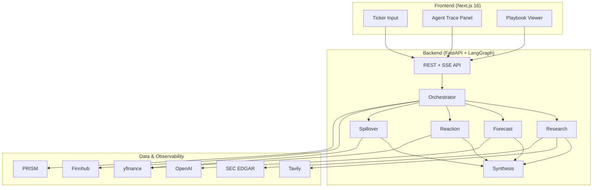

# EarningsPulse

Know the report. Read the reaction. Watch the ripple.

Pre-earnings research agent that builds an Earnings Playbook covering report sentiment, price-reaction scenarios, and peer spillover. Built for the [AI x FINANCE HACKATHON – MONEY TALKS](https://luma.com/vljpdtre) (Money Intelligence track).

All build phases are on `main`. Deploy with [docs/DEPLOYMENT.md](docs/DEPLOYMENT.md). Demo with [docs/DEMO_SCRIPT.md](docs/DEMO_SCRIPT.md).

## Overview

EarningsPulse prepares investors for after-hours earnings. Before a company reports, it:

1. Researches the ticker (news, filings, analyst context via Tavily and SEC EDGAR)
2. Forecasts report sentiment (beat/miss probabilities with confidence tiers)
3. Models reactions from historical patterns, including dip-then-rally
4. Maps peers that tend to move in sympathy
5. Synthesizes a structured Earnings Playbook with sources, scenarios, and export

Each agent step streams over SSE and is logged in PRISM-compatible trace format.

## Architecture



| Layer | Stack |
|-------|-------|
| Frontend | Next.js 16, React 19, TypeScript 7, Tailwind CSS, lightweight-charts, oxlint, Knip, Bun |
| Backend | FastAPI, LangGraph, Pydantic v2 |
| LLM | OpenAI GPT-4o |
| Research | Tavily Search API |
| Market data | yfinance, Finnhub |
| Observability | PRISM (Block Convey) + local trace logs |

## Project structure

```
EarningsPulse/
├── backend/              # FastAPI + LangGraph agents
│   ├── app/              # Application code
│   ├── demo/             # Pre-cached demo playbooks (AAPL)
│   ├── pyproject.toml    # Python deps + ruff + ty config
│   ├── uv.lock           # Locked dependency versions
│   ├── Dockerfile        # Production container
│   └── railway.toml      # Railway deploy config
├── frontend/             # Next.js 16 web app
│   ├── e2e/              # Playwright tests
│   ├── bun.lock          # Bun lockfile
│   ├── bunfig.toml       # Bun as package manager; Node as Next runtime
│   ├── .oxlintrc.json    # oxlint (primary frontend linter)
│   ├── knip.json         # unused files, deps, and exports
│   ├── Dockerfile        # Production container
│   └── vercel.json       # Vercel deploy config
├── docs/                 # Spec, plan, deployment, demo script
├── scripts/              # Backtest, demo seed, test & verify utilities
├── render.yaml           # Render blueprint (alternative to Railway)
└── docker-compose.yml    # Local full-stack
```

## Quick start (local)

### 1. Clone and configure

```bash
cp .env.example .env
# Edit .env with your API keys (not required for Demo AAPL)
```

### 2. Run with Docker (recommended)

```bash
docker compose up --build
```

- Frontend: http://localhost:3000
- Backend API: http://localhost:8000
- API Docs: http://localhost:8000/docs

### 3. Run locally (development)

Backend:

```bash
cd backend
uv sync                    # install deps into .venv (includes dev tools)
uv run uvicorn app.main:app --reload --port 8000
```

Install [uv](https://docs.astral.sh/uv/) if needed: `curl -LsSf https://astral.sh/uv/install.sh | sh`

Frontend:

```bash
cd frontend
bun install
bun run dev
```

Install [Bun](https://bun.sh/) if needed: `curl -fsSL https://bun.sh/install | bash`

Bun is the package manager only. Next.js 16.3 still builds and runs on Node (Vercel Functions, `next start`, and the standalone Docker image). Do not set `bunVersion` in `vercel.json` or use `bun run --bun next build`. Next 16.2/16.3 still has Bun-runtime regressions on Vercel.

## Production deployment

Deploy the frontend to Vercel and the backend to Railway or Render.

Full guide: [docs/DEPLOYMENT.md](docs/DEPLOYMENT.md)

Checklist:

1. Deploy backend from `backend/` (Dockerfile included)
2. Set `FRONTEND_URL`, `OPENAI_API_KEY`, `TAVILY_API_KEY`, `FINNHUB_API_KEY`, `SEC_USER_AGENT`
3. Deploy frontend from `frontend/` to Vercel
4. Set `NEXT_PUBLIC_BACKEND_URL` to your backend URL
5. Verify:

```bash
./scripts/verify_deployment.sh https://your-api.up.railway.app https://your-app.vercel.app
```

Tag a release after verification:

```bash
git tag -a v1.0.0 -m "EarningsPulse v1.0.0 hackathon release"
git push origin v1.0.0
```

## Demo

Instant demo (no API keys): click Demo AAPL on the home page.

3-minute pitch script: [docs/DEMO_SCRIPT.md](docs/DEMO_SCRIPT.md)

Seed or refresh the demo cache:

```bash
cd backend
uv run python ../scripts/seed_demo.py --offline --ticker AAPL   # offline
uv run python ../scripts/seed_demo.py --ticker AAPL             # live agent run
```

## API reference

Interactive docs: `GET /docs` (Swagger UI)

| Method | Endpoint | Description |
|--------|----------|-------------|
| `GET` | `/health` | Liveness probe |
| `GET` | `/ready` | Readiness + key configuration status |
| `POST` | `/api/playbook/generate` | Start playbook generation `{ "ticker": "AAPL" }` |
| `GET` | `/api/playbook/stream/{job_id}` | SSE agent progress stream |
| `GET` | `/api/playbook/{job_id}` | Fetch completed playbook |
| `GET` | `/api/playbook/{job_id}/export/json` | Download playbook JSON |
| `GET` | `/api/playbook/{job_id}/export/bundle` | Download playbook + trace bundle |
| `POST` | `/api/playbook/demo/{ticker}` | Instant demo from cache |
| `GET` | `/api/playbook/demo` | List available demo tickers |
| `GET` | `/api/calendar?days=7` | Upcoming earnings events |
| `GET` | `/api/calendar/{ticker}` | Ticker-specific earnings dates |
| `GET` | `/api/trace/{job_id}` | Full PRISM-compatible trace log |

Rate limit: 10 playbook generation requests per minute per client IP.

### Example: generate and stream

```bash
# Start job
curl -X POST http://localhost:8000/api/playbook/generate \
  -H "Content-Type: application/json" \
  -d '{"ticker": "AAPL"}'

# Stream progress (SSE)
curl -N http://localhost:8000/api/playbook/stream/<job_id>

# Fetch result
curl http://localhost:8000/api/playbook/<job_id>
```

## Health checks

| Service  | Endpoint |
|----------|----------|
| Backend  | `GET /health` |
| Backend  | `GET /ready` |
| Frontend | `GET /api/health` |

## API keys

| Key | Purpose | Required for |
|-----|---------|--------------|
| `OPENAI_API_KEY` | LLM agents | Live generation |
| `TAVILY_API_KEY` | Live web research | Live generation |
| `FINNHUB_API_KEY` | Earnings calendar | Live generation (yfinance fallback) |
| `SEC_USER_AGENT` | SEC EDGAR access | Live generation |
| `PRISM_API_KEY` + `PRISM_PROJECT_ID` | Agent observability | Optional |

Demo AAPL and health checks work without any keys.

## Testing

Property-based tests use [Hypothesis](https://hypothesis.readthedocs.io/) (backend) and [Hegel](https://hegel.dev/typescript) (frontend). Agent guidance for Hegel tests is in `.cursor/skills/hegel/`.

```bash
# Backend (unit + Hypothesis property tests)
cd backend && uv run python -m pytest

# Lint backend (ruff) and type-check (ty)
cd backend && uv run ruff check app tests && uv run ruff format --check app tests
cd backend && uv run ty check

# Frontend property tests (Hegel via Vitest)
cd frontend && bun run test:property

# Lint frontend (oxlint)
cd frontend && bun run lint

# Unused files, dependencies, and exports (Knip)
cd frontend && bun run knip

# React Doctor health scan
cd frontend && bun run doctor

# Vercel plugin for Cursor/Claude (skills, /deploy, /env, /status)
npx plugins add vercel/vercel-plugin --yes --target cursor --scope project

# Typecheck frontend (TypeScript 7 / tsc)
cd frontend && bun run typecheck

# Full suite (pytest + property tests + build + E2E)
./scripts/run_tests.sh

# Skip E2E locally
SKIP_E2E=1 ./scripts/run_tests.sh

# E2E only
cd frontend && bunx playwright install chromium && bun run test:e2e
```

CI (GitHub Actions) on every push/PR to `main`: backend ruff + ty + pytest, then frontend property tests / oxlint / Knip / `tsc --noEmit` / build, then Playwright E2E. A separate [React Doctor](https://www.react.doctor/ci) workflow scans `frontend/` on PRs (advisory, changed-files only).

Toolchain: uv + ruff + ty on the backend; Bun + oxc/oxlint + [Knip](https://github.com/webpro-nl/knip) + TypeScript 7 on the frontend.

oxlint is a CI/dev linter, not a deploy runtime. Next 16 Turbopack already uses oxc as its parser. This repo is a single Next app plus a Python/uv backend, so Turborepo would not orchestrate anything Vercel or uv do not already handle.

Next.js 16.3 type-checks `next build` with the project-local TypeScript 7 `tsc` CLI.

Backtest validation:

```bash
cd backend
uv run python ../scripts/backtest_reactions.py --tickers AAPL NVDA TSLA JPM AMZN
```

## Documentation

| Doc | Description |
|-----|-------------|
| [PROJECT_SPEC.md](docs/PROJECT_SPEC.md) | Product specification |
| [IMPLEMENTATION_PLAN.md](docs/IMPLEMENTATION_PLAN.md) | Build plan and phases |
| [DEPLOYMENT.md](docs/DEPLOYMENT.md) | Production deploy guide |
| [DEMO_SCRIPT.md](docs/DEMO_SCRIPT.md) | 3-minute hackathon pitch |

## Implementation phases

| Phase | Status | Description |
|-------|--------|-------------|
| 0 | Done | Foundation: scaffold, models, health checks |
| 1 | Done | Data layer: Tavily, yfinance, Finnhub, EDGAR |
| 2 | Done | Analysis engines: reaction analyzer, peer map |
| 3 | Done | Agents: LangGraph orchestrator + 5 agents |
| 4 | Done | API: playbook generation + SSE streaming |
| 5 | Done | PRISM observability integration |
| 6 | Done | Frontend UI |
| 7 | Done | Polish: export, calendar, demo seed |
| 8 | Done | Testing: E2E, backtest validation, CI |
| 9 | Done | Deploy: configs, docs, demo script |

## Disclaimer

Not financial advice. For informational and decision-support purposes only.

This project has been made with the help of GIDE, Prism AI. 

🧑‍💻 Developed by Omkar, Tushar, Ankush
