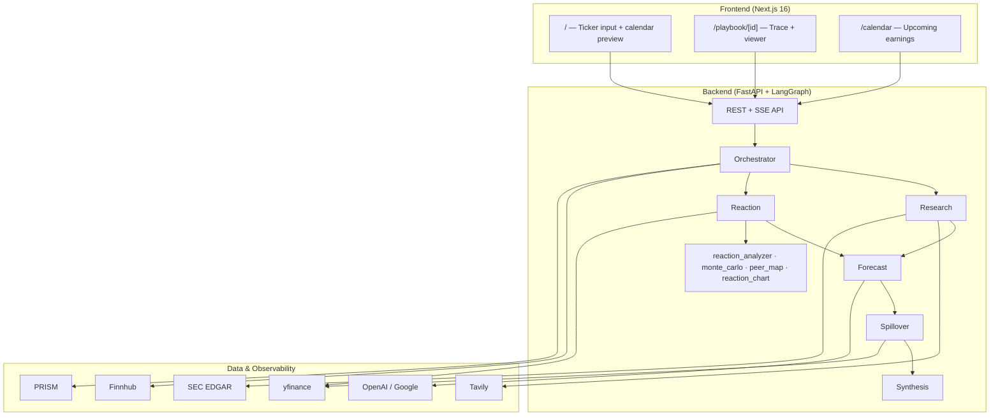

# EarningsPulse

**Know the report. Read the reaction. Watch the ripple.**

Pre-earnings research agent that builds an **Earnings Playbook** covering report sentiment, price-reaction scenarios, and peer spillover. Built for the [AI x FINANCE HACKATHON – MONEY TALKS](https://luma.com/vljpdtre) (Money Intelligence track).

| | |
|---|---|
| **Deploy** | [docs/DEPLOYMENT.md](docs/DEPLOYMENT.md) |
| **Demo pitch** | [docs/DEMO_SCRIPT.md](docs/DEMO_SCRIPT.md) |
| **Product spec** | [docs/PROJECT_SPEC.md](docs/PROJECT_SPEC.md) |
| **Repository** | [omkargadute/EarningsPulse](https://github.com/omkargadute/EarningsPulse) |

## Table of contents

- [Overview](#overview)
- [Features](#features)
- [How it works](#how-it-works)
- [Architecture](#architecture)
- [Tech stack](#tech-stack)
- [Web app](#web-app)
- [Playbook deliverable](#playbook-deliverable)
- [Project structure](#project-structure)
- [Prerequisites](#prerequisites)
- [Quick start](#quick-start-local)
- [Development](#development)
- [Production deployment](#production-deployment)
- [Demo](#demo)
- [API reference](#api-reference)
- [Environment variables](#environment-variables)
- [Testing](#testing)
- [Documentation](#documentation)
- [Disclaimer](#disclaimer)

## Overview

EarningsPulse prepares investors for after-hours earnings. Before a company reports, it:

1. **Researches** the ticker — news, filings, analyst context via Tavily and SEC EDGAR
2. **Forecasts** report sentiment — beat / inline / miss probabilities with confidence tiers
3. **Models reactions** from historical patterns — dip-then-rally, sell-the-news, Monte Carlo bands, out-of-sample validation
4. **Maps peers** that tend to move in sympathy on report day
5. **Synthesizes** a structured Earnings Playbook with sources, scenarios, chart workspace, and export

Agent traces stream to the browser over **SSE** (`EventSource`) after each graph node finishes. Completed runs save a local JSON trace and optionally submit it to **PRISM** (Block Convey).

## Features

| Area | What you get |
|------|----------------|
| Multi-agent pipeline | LangGraph orchestrator: Research + Reaction in parallel → Forecast → Spillover → Synthesis |
| Live observability | SSE agent trace panel with tool calls, latencies, and PRISM-compatible logs |
| Reaction intelligence | Archetype classification, Monte Carlo bootstrap paths, chronological train/test validation |
| Reaction workspace | Daily OHLCV candles, historical path overlays, pivot/support/resistance, move histogram |
| Peer spillover | GICS-style taxonomy + historical co-movement correlation on past earnings |
| Earnings calendar | Upcoming events (Finnhub with yfinance fallback) |
| Demo mode | Instant AAPL playbook from bundled cache — no API keys required |
| Export | JSON playbook, JSON bundle (playbook + trace), browser print / PDF |
| Resilience | Provider fallbacks (OpenAI ↔ Google LLM, Tavily → EDGAR, Finnhub → yfinance), heuristic forecast when no LLM key |

## How it works

```
User enters ticker
    → POST /api/playbook/generate  (returns job_id)
    → Browser opens /playbook/{job_id}
    → EventSource connects to GET /api/playbook/stream/{job_id}
    → LangGraph runs agents; trace events stream in real time
    → playbook_ready SSE → fetch GET /api/playbook/{job_id}
    → Playbook viewer renders all sections + reaction chart
```

Optional: `POST /api/playbook/demo/AAPL` skips the agent run and loads pre-cached JSON instantly.

## Architecture



### Agent graph

```
START
  ├─→ Research Agent   (Tavily, EDGAR, earnings calendar)
  └─→ Reaction Agent   (price history, pattern engine, Monte Carlo, validation)
        │
        ▼
   Forecast Agent      (LLM or heuristic on research bundle)
        │
        ▼
   Spillover Agent     (peer map, correlation, peer context)
        │
        ▼
   Synthesis Agent     (merge outputs, confidence, sources)
        │
        ▼
      Playbook JSON
```

## Tech stack

| Layer | Stack |
|-------|-------|
| Frontend | Next.js 16, React 19, TypeScript 7, Tailwind CSS, lightweight-charts v5, React Compiler, oxlint, Knip, Bun 1.4 |
| Backend | Python 3.12, FastAPI, LangGraph, Pydantic v2, uv, ruff, ty, pytest, Hypothesis |
| LLM | `LLM_PROVIDER` order: configured provider → other provider → deterministic heuristic |
| Research | Tavily Search API, SEC EDGAR |
| Market data | yfinance, Finnhub |
| Observability | PRISM SDK (`prismtrace-sdk`) + local trace JSON in `logs/traces/` |
| Deploy | Vercel (frontend), Railway / Render / Modal / Docker (backend) |
| CI | GitHub Actions — ruff, Deptry, ty, pytest, Hegel property tests, oxlint, Knip, tsc, build, Playwright E2E |

## Web app

| Route | Purpose |
|-------|---------|
| `/` | Hero, ticker input, Demo AAPL, upcoming earnings preview |
| `/playbook/[id]` | Live agent trace (`RunPanel`) + playbook sections as they complete |
| `/calendar` | Full earnings calendar for the next 7–30 days |
| `/api/health` | Frontend health probe (used by Docker and deploy checks) |

**Design system:** glass panels on light stone paper (`#eef2fb`) or dark navy (`#0b0f16`) via `ThemeProvider`; navy/white ink tokens; colour reserved for direction (`up` / `down` / `caution`); system UI sans + IBM Plex Mono for figures and tickers; page shell `max-w-page` (`85rem`); `RunPanel.tsx` is the only always-dark surface.

## Playbook deliverable

Each completed run produces one JSON playbook with six sections:

| Section | Contents |
|---------|----------|
| **A. Executive summary** | Beat/inline/miss odds, primary reaction archetype, confidence, top drivers |
| **B. Report forecast** | Key metrics, bull/base/bear cases, surprise factors |
| **C. Price reaction** | Scenario tree, reaction stats, Monte Carlo bands, validation summary, chart workspace payload |
| **D. Peer spillover** | Ranked peers with correlation, relationship type, direction bias |
| **E. Action playbook** | If/then decision-support rules tied to historical patterns |
| **F. Sources & trace** | Cited URLs and filings; PRISM trace reference |

Reaction archetypes: `dip_then_rally`, `immediate_rip`, `sell_the_news`, `gap_and_hold`, `volatility_pin`, `insufficient_data`.

## Project structure

```
EarningsPulse/
├── backend/                    # FastAPI + LangGraph agents
│   ├── app/
│   │   ├── main.py             # FastAPI entry
│   │   ├── config.py           # Settings from env
│   │   ├── api/routes/         # health, playbook, demo, calendar, trace
│   │   ├── agents/             # orchestrator + 5 agents + llm + mappers
│   │   ├── services/           # data clients, analyzers, job store, SSE, PRISM
│   │   ├── models/             # Pydantic schemas (playbook, trace, analysis)
│   │   └── utils/              # cache, confidence
│   ├── demo/                   # Pre-cached demo playbooks (AAPL)
│   ├── tests/                  # pytest + Hypothesis property tests
│   ├── modal_app.py            # Modal serverless deploy entry
│   ├── pyproject.toml          # Python deps + ruff + ty config
│   ├── uv.lock
│   ├── Dockerfile
│   └── railway.toml
├── frontend/                   # Next.js 16 web app
│   ├── src/
│   │   ├── app/                # App Router pages + layout
│   │   ├── components/         # UI, playbook sections, reaction workspace
│   │   ├── hooks/              # usePlaybookStream (SSE)
│   │   └── lib/                # api, types, export, format, theme
│   ├── e2e/                    # Playwright tests
│   ├── tests/                  # Hegel property tests (Vitest)
│   ├── bun.lock
│   ├── knip.json
│   ├── .oxlintrc.json
│   ├── Dockerfile
│   └── vercel.json
├── docs/                       # Spec, plan, deployment, demo, reviews
├── scripts/                    # run_tests, verify_deployment, seed_demo, backtest
├── .github/workflows/          # ci.yml, react-doctor.yml
├── docker-compose.yml
├── render.yaml                 # Render blueprint (backend + frontend)
├── vercel.json                 # Repo-root Vercel fallback (prefer frontend/ root)
├── package.json                # Repo-root pointer for Vercel zero-config
├── .env.example
├── AGENTS.md                   # Agent memory (Cursor)
└── README.md
```

## Prerequisites

| Tool | Version | Install |
|------|---------|---------|
| Python | 3.12 | via [uv](https://docs.astral.sh/uv/) |
| uv | latest | `curl -LsSf https://astral.sh/uv/install.sh \| sh` |
| Bun | 1.4 | `curl -fsSL https://bun.sh/install \| bash` |
| Node.js | 24.x | Required for Next.js production build (Bun installs deps) |
| Docker | optional | For `docker compose up` |

## Quick start (local)

### 1. Clone and configure

```bash
git clone https://github.com/omkargadute/EarningsPulse.git
cd EarningsPulse
cp .env.example .env
# Edit .env with API keys (not required for Demo AAPL)
```

### 2. Run with Docker (recommended)

```bash
docker compose up --build
```

- Frontend: http://localhost:3000
- Backend API: http://localhost:8000
- API docs: http://localhost:8000/docs

### 3. Run locally (development)

**Backend:**

```bash
cd backend
uv sync                    # install deps into .venv (includes dev tools)
uv run uvicorn app.main:app --reload --port 8000
```

**Frontend:**

```bash
cd frontend
bun install
bun run dev
```

Use **Bun** for dependency installation and scripts. The checked-in Next.js build and deployment configurations run Next.js on **Node**.

## Development

### Backend commands

```bash
cd backend
uv run uvicorn app.main:app --reload --port 8000   # dev server
uv run python -m pytest                             # all tests
uv run ruff check app tests && uv run ruff format --check app tests
uv run ty check
uv run deptry .
```

### Frontend commands

```bash
cd frontend
bun run dev          # Turbopack dev server
bun run lint         # oxlint
bun run typecheck    # tsc --noEmit
bun run knip         # unused files, deps, exports
bun run doctor       # React Doctor health scan
bun run test:property
bun run test:e2e     # starts backend + frontend
```

### Full test suite

```bash
./scripts/run_tests.sh           # everything including E2E
SKIP_E2E=1 ./scripts/run_tests.sh
```

See [backend/README.md](backend/README.md) and [frontend/README.md](frontend/README.md) for module-level detail.

## Production deployment

Deploy the **frontend** to Vercel. The **backend** supports Modal, Railway, Render, and Docker.

Full guide: [docs/DEPLOYMENT.md](docs/DEPLOYMENT.md)

Checklist:

1. Deploy backend from `backend/` (Dockerfile included)
2. Set `FRONTEND_URL`, provider keys, and CORS per the deployment guide
3. Deploy frontend from `frontend/` to Vercel (set Root Directory to `frontend`)
4. Set `NEXT_PUBLIC_BACKEND_URL` to your backend URL and redeploy
5. Verify:

```bash
./scripts/verify_deployment.sh https://your-api.up.railway.app https://your-app.vercel.app
```

**Note:** Jobs and playbooks live in the API process memory. A restart loses in-flight and completed runs unless you export them. Modal and single-container Railway/Render deployments should run one process until shared job storage exists.

## Demo

**Instant demo (no API keys):** click **Demo AAPL** on the home page.

3-minute pitch script: [docs/DEMO_SCRIPT.md](docs/DEMO_SCRIPT.md)

Seed or refresh the demo cache:

```bash
cd backend
uv run python ../scripts/seed_demo.py --offline --ticker AAPL   # offline mock
uv run python ../scripts/seed_demo.py --ticker AAPL             # live agent run
```

## API reference

Interactive docs: `GET /docs` (Swagger UI) · `GET /redoc` (ReDoc)

### Endpoints

| Method | Endpoint | Description |
|--------|----------|-------------|
| `GET` | `/health` | Liveness probe |
| `GET` | `/ready` | Readiness + key configuration status (503 if `PRISM_REQUIRED=true` and PRISM not configured) |
| `POST` | `/api/playbook/generate` | Start playbook generation |
| `GET` | `/api/playbook/stream/{job_id}` | SSE agent progress stream |
| `GET` | `/api/playbook/{job_id}` | Fetch job status and completed playbook |
| `GET` | `/api/playbook/{job_id}/export/json` | Download playbook JSON |
| `GET` | `/api/playbook/{job_id}/export/bundle` | Download playbook + trace bundle |
| `POST` | `/api/playbook/demo/{ticker}` | Instant demo from cache |
| `GET` | `/api/playbook/demo` | List available demo tickers |
| `GET` | `/api/calendar?days=7` | Upcoming earnings events (1–30 days) |
| `GET` | `/api/calendar/{ticker}` | Next earnings date for a ticker |
| `GET` | `/api/trace/{job_id}` | Full PRISM-compatible trace log |

**Rate limit:** 10 playbook generation requests per minute per client IP.

### Generate request

```json
{
  "ticker": "AAPL",
  "earnings_date": "2026-01-30T21:00:00Z"
}
```

`ticker` is required (1–10 chars, letters/dots/hyphens). `earnings_date` is optional ISO datetime.

### SSE event types

| `type` | When |
|--------|------|
| `run_started` | Pipeline begins |
| `agent_start` | Agent node started |
| `tool_call` | Tool invoked, completed, failed, or confidence updated |
| `agent_complete` | Agent node finished |
| `playbook_ready` | Job completed successfully |
| `error` | Job failed |
| `heartbeat` | Keep-alive while waiting |

Each event includes a `trace` object with the full PRISM-compatible record when applicable.

### Example: generate and stream

```bash
# Start job
curl -X POST http://localhost:8000/api/playbook/generate \
  -H "Content-Type: application/json" \
  -d '{"ticker": "AAPL"}'

# Stream progress (SSE)
curl -N http://localhost:8000/api/playbook/stream/<job_id>

# Fetch result
curl http://localhost:8000/api/playbook/<job_id>
```

## Environment variables

Copy [`.env.example`](.env.example) to `.env`. Key variables:

| Variable | Purpose | Required for |
|----------|---------|--------------|
| `OPENAI_API_KEY` | OpenAI LLM forecast | Optional; heuristic fallback without any LLM key |
| `GOOGLE_API_KEY` | Google/Gemma LLM fallback | Optional |
| `LLM_PROVIDER` | `openai` (default) or `google` — tries configured provider first | Optional |
| `LLM_MODEL` | OpenAI model (default `gpt-4o`) | When using OpenAI |
| `GOOGLE_LLM_MODEL` | Google model (default `gemini-2.5-flash`; auto-fallback chain in code) | When using Google |
| `TAVILY_API_KEY` | Live web research | Live generation; agents degrade without it |
| `FINNHUB_API_KEY` | Earnings calendar | Calendar endpoint; ticker lookups fall back to yfinance |
| `SEC_USER_AGENT` | SEC EDGAR fair-access header | Live generation |
| `PRISM_API_KEY` + `PRISM_PROJECT_ID` | Agent observability | Optional locally; set `PRISM_REQUIRED=true` for hackathon |
| `PRISM_HOST` | PRISM API base URL | Optional |
| `FRONTEND_URL` | Production frontend origin (auto-merged into CORS) | Production |
| `NEXT_PUBLIC_BACKEND_URL` | Backend URL baked into frontend at build | Production frontend |
| `ENVIRONMENT` | `development` or `production` | Production |
| `REACTION_HISTORY_LIMIT` | Max historical earnings events (default 40) | Optional |
| `MONTE_CARLO_SIMULATIONS` | Bootstrap simulation count (default 1000) | Optional |
| `VALIDATION_TRAIN_RATIO` | Train split for pattern validation (default 0.7) | Optional |
| `CORS_ORIGINS` | Extra allowed origins JSON array | Optional |
| `CORS_ORIGIN_REGEX` | Regex for preview deploys (Modal default: `*.vercel.app`) | Optional |

Demo AAPL and `/health` work without any keys.

## Testing

Property-based tests use [Hypothesis](https://hypothesis.readthedocs.io/) (backend) and [Hegel](https://hegel.dev/typescript) (frontend). Agent guidance for Hegel tests: `.cursor/skills/hegel/`.

```bash
# Backend (unit + Hypothesis property tests)
cd backend && uv run python -m pytest

# Lint backend (ruff) and type-check (ty)
cd backend && uv run ruff check app tests && uv run ruff format --check app tests
cd backend && uv run ty check

# Check backend dependency usage
cd backend && uv run deptry .

# Frontend property tests (Hegel via Vitest)
cd frontend && bun run test:property

# Lint frontend (oxlint)
cd frontend && bun run lint

# Unused files, dependencies, and exports (Knip)
cd frontend && bun run knip

# React Doctor health scan
cd frontend && bun run doctor

# Typecheck frontend (TypeScript 7 / tsc)
cd frontend && bun run typecheck

# Full suite (pytest + property tests + build + E2E)
./scripts/run_tests.sh

# Skip E2E locally
SKIP_E2E=1 ./scripts/run_tests.sh

# E2E only
cd frontend && bunx playwright install chromium && bun run test:e2e
```

**CI** (GitHub Actions) on every push/PR to `main`: backend ruff + Deptry + ty + pytest, then frontend property tests / oxlint / Knip / `tsc --noEmit` / build, then Playwright E2E. A separate [React Doctor](https://www.react.doctor/ci) workflow scans `frontend/` on PRs (advisory, changed-files only). CI wraps `uv sync` and `bun install` with Socket Firewall Free (`sfw`) in firewall-free mode.

**Backtest validation:**

```bash
cd backend
uv run python ../scripts/backtest_reactions.py --tickers AAPL NVDA TSLA JPM AMZN
```

## Documentation

| Doc | Description |
|-----|-------------|
| [PROJECT_SPEC.md](docs/PROJECT_SPEC.md) | Product specification and hackathon alignment |
| [IMPLEMENTATION_PLAN.md](docs/IMPLEMENTATION_PLAN.md) | Build plan, phases, and architecture decisions |
| [DEPLOYMENT.md](docs/DEPLOYMENT.md) | Production deploy guide (Vercel, Railway, Render, Modal, Docker) |
| [DEMO_SCRIPT.md](docs/DEMO_SCRIPT.md) | 3-minute hackathon pitch script |
| [MAINTAINABILITY_REVIEW.md](docs/MAINTAINABILITY_REVIEW.md) | Engineering review and follow-up items |
| [docs/README.md](docs/README.md) | Documentation index |
| [backend/README.md](backend/README.md) | Backend modules, agents, and services |
| [frontend/README.md](frontend/README.md) | Frontend routes, components, and design tokens |
| [AGENTS.md](AGENTS.md) | Cursor agent memory and workspace conventions |

## Disclaimer

Not financial advice. For informational and decision-support purposes only.

This project has been made with the help of GIDE, Prism AI. 

🧑‍💻 Developed by Omkar, Tushar, Ankush
