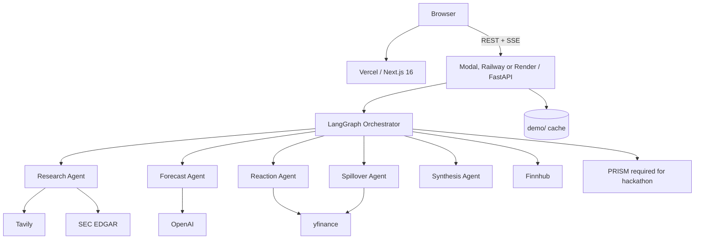

# EarningsPulse deployment guide

The frontend runs on Vercel. The repository includes backend configurations for Modal, Railway, and Render, plus Docker Compose for local use.

The backend can also run as a Modal web function while the frontend remains on Vercel:

```bash
cd backend
uv sync --frozen
uv run modal deploy modal_app.py
```

The initial Modal configuration accepts HTTPS origins under `vercel.app`, which makes
Vercel preview deployments work. After the frontend has a stable production domain,
replace `CORS_ORIGIN_REGEX` in `backend/modal_app.py` with an exact `FRONTEND_URL` and
redeploy. Set the frontend's `NEXT_PUBLIC_BACKEND_URL` to the `modal.run` URL printed by
the deploy command, then redeploy the frontend because this value is baked in at build time.

## Runtime and storage limits

Jobs and their traces live in the API process. A restart loses generated playbooks and job status. Run one API process until shared job storage is implemented. The Modal configuration sets `max_containers=1`, but its five-minute idle scale-down still discards jobs.

`TraceStore` also writes JSON files. Modal writes these to `/tmp/logs/traces` without a persistent volume, so they do not survive container replacement. These files contain traces, not recoverable playbooks. Download exports before relying on a saved run.

Store provider keys in the Modal secret named `earningspulse` (`modal secret create earningspulse --from-dotenv backend/.env --force`). The deploy also merges a local `backend/.env` if present. Redeploy after changing either. The bundled AAPL demo needs no credentials. Set `LLM_PROVIDER=google` to try Google before OpenAI; the default order is OpenAI then Google.

## Architecture (production)



| Component | Platform | URL pattern |
|-----------|----------|-------------|
| Frontend | Vercel | `https://<project>.vercel.app` |
| Backend API | Railway or Render | `https://<service>.up.railway.app` or `https://<service>.onrender.com` |

## Prerequisites

- GitHub repo connected to Vercel and Railway/Render
- Provider settings from `.env.example`. OpenAI or Google supplies the LLM forecast; no LLM key uses heuristics. Tavily supplies research, and Finnhub is required for the upcoming-calendar endpoint.
- Demo cache at `backend/demo/aapl.json` (already in the repo)

## Step 1. Deploy backend (Railway)

1. Create a project at [railway.app](https://railway.app) and choose Deploy from GitHub repo.
2. Add a service and set Root Directory to `backend`.
3. Railway picks up `backend/Dockerfile` and `backend/railway.toml`.
4. Set environment variables (Settings → Variables):

| Variable | Required | Example |
|----------|----------|---------|
| `ENVIRONMENT` | Yes | `production` |
| `FRONTEND_URL` | Yes | `https://your-app.vercel.app` |
| `OPENAI_API_KEY` or `GOOGLE_API_KEY` | For LLM forecasts | Provider key |
| `TAVILY_API_KEY` | Yes (live gen) | `tvly-...` |
| `FINNHUB_API_KEY` | Recommended | `...` |
| `SEC_USER_AGENT` | Yes | `EarningsPulse you@email.com` |
| `PRISM_API_KEY` | Hackathon | From Block Convey |
| `PRISM_PROJECT_ID` | Hackathon | `de776c8e-0af3-4e09-9e93-15bc99b24c22` |
| `PRISM_HOST` | Hackathon | `https://prism-api-prod.up.railway.app` |
| `PRISM_REQUIRED` | Hackathon | `true` returns 503 from `/ready` until Prism is configured |

`FRONTEND_URL` is merged into CORS automatically. You only need `CORS_ORIGINS` if you have multiple frontend domains.

5. Generate a public domain (Settings → Networking → Generate Domain).
6. Confirm health: `curl https://<your-api>/health`

### Alternative: Render

1. Connect the repo at [render.com](https://render.com).
2. Use the included `render.yaml` blueprint, or create a Web Service manually:
   - Root directory: `backend`
   - Dockerfile path: `backend/Dockerfile`
   - Health check path: `/health`
3. Set the same environment variables as above.

## Step 2. Deploy frontend (Vercel)

1. Import the repo at [vercel.com](https://vercel.com).
2. Set Root Directory to `frontend`. If that setting is empty, the repo-root `vercel.json` and `frontend/` pointers still let Git deploys detect Next.js. Prefer the dashboard setting so file tracing stays inside `frontend/`.
3. Framework preset: Next.js (auto-detected).
4. Set this environment variable:

| Variable | Value |
|----------|-------|
| `NEXT_PUBLIC_BACKEND_URL` | `https://<your-backend-api-url>` |

5. Deploy. Vercel detects Bun from `frontend/bun.lock` and uses `frontend/vercel.json` (`npm exec bun@1.4.0 install --frozen-lockfile`, then `next build` on Node). Do not enable the Bun Function runtime (`bunVersion`). The install command pins Bun for the checked-in lockfile.

## Step 3. Link frontend and backend

After Vercel gives you a production URL:

1. Update Railway/Render `FRONTEND_URL` to your Vercel URL (for example `https://earningspulse.vercel.app`).
2. Redeploy the backend so CORS picks up the new origin.
3. Confirm `NEXT_PUBLIC_BACKEND_URL` on Vercel points to the backend URL.
4. Redeploy the frontend if you changed the backend URL.

## Step 4. Verify production

```bash
chmod +x scripts/verify_deployment.sh

./scripts/verify_deployment.sh \
  https://your-api.up.railway.app \
  https://your-app.vercel.app
```

Manual checks:

- [ ] Home page loads; disclaimer visible
- [ ] Demo AAPL loads without API keys
- [ ] Live ticker generation completes; record elapsed time and any provider failures
- [ ] Agent trace panel streams during generation
- [ ] JSON export downloads
- [ ] Calendar page loads

## Environment variables reference

See [`.env.example`](../.env.example) for the full list.

### Production-only notes

- `ENVIRONMENT=production` shows up in the `/health` response
- `FRONTEND_URL` must match your Vercel domain exactly, including `https://`
- `PORT` is injected by Railway/Render; the Dockerfile respects it
- `NEXT_PUBLIC_BACKEND_URL` is baked at Vercel build time; redeploy after changes

### Optional overrides

```bash
# Only if you need multiple allowed origins (preview deploys, custom domain)
CORS_ORIGINS=["https://earningspulse.vercel.app","https://preview.vercel.app"]
```

## Docker (self-hosted)

```bash
cp .env.example .env
# Set FRONTEND_URL and API keys

docker compose up --build
```

For production Docker, set build args on the frontend service:

```yaml
args:
  NEXT_PUBLIC_BACKEND_URL: https://api.yourdomain.com
```

## Demo reliability in production

| Mode | API keys | Use case |
|------|----------|----------|
| Demo AAPL | None | Hackathon pitch, CI, offline fallback |
| Live generation | Provider keys enable their respective data sources | Current data and forecast, with fallback behavior when providers fail |

Pre-warm before presenting:

```bash
curl -X POST https://your-api/api/playbook/demo/AAPL
curl -X POST https://your-api/api/playbook/generate \
  -H "Content-Type: application/json" \
  -d '{"ticker":"AAPL"}'
```

See [DEMO_SCRIPT.md](./DEMO_SCRIPT.md) for the 3-minute pitch flow.

## Release tagging

After production is verified:

```bash
git checkout main
git pull
git tag -a v1.0.0 -m "EarningsPulse v1.0.0 hackathon release"
git push origin v1.0.0
```

## Troubleshooting

| Symptom | Fix |
|---------|-----|
| CORS error in browser | Set `FRONTEND_URL` on backend to exact Vercel URL; redeploy backend |
| Demo AAPL 404 | Ensure `backend/demo/aapl.json` is in the Docker image (included in Dockerfile) |
| Vercel platform `NOT_FOUND` (black error page, not the Next.js 404) | The Git project built the repo root with no Next.js app. Set Root Directory to `frontend` and Redeploy, or keep the repo-root `package.json` / `next.config.ts` pointers so zero-config can see the app |
| Frontend can't reach API | Check `NEXT_PUBLIC_BACKEND_URL`; redeploy Vercel after changing it |
| Generation fails | Check `/ready` for missing keys; verify OpenAI/Tavily quotas |
| SSE stream disconnects | Confirm backend URL is HTTPS; some proxies need longer timeouts |

## HTTPS

Vercel and Railway/Render provide HTTPS by default. No extra TLS setup.
